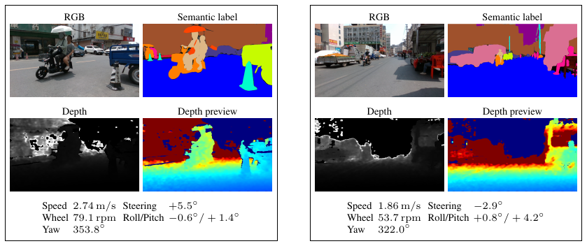

# SPIN-UV Experiments



Code kept for the paper-facing RGB baselines, RGB-D baselines, and transfer-gap comparison.

## Contents

- `run_autodl_e1_controlled.sh`: RGB baseline suite.
- `run_autodl_e1_rgbd_baselines.sh`: RGB-D baseline suite.
- `e2_domain_gap/run_autodl_e2_imagenet1k_b5.sh`: SegFormer-B5 transfer-gap comparison.
- `scripts/`: shared training and result collection utilities.

Expected dataset layout:

```text
data/
  processed/spinuv_semantic/
  raw/dataset1/
```
